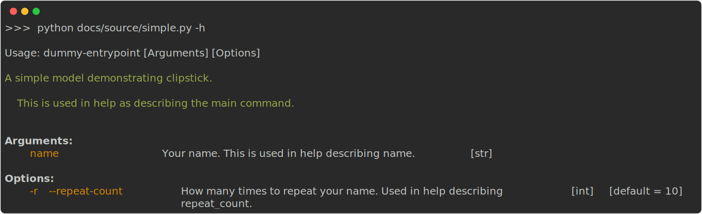
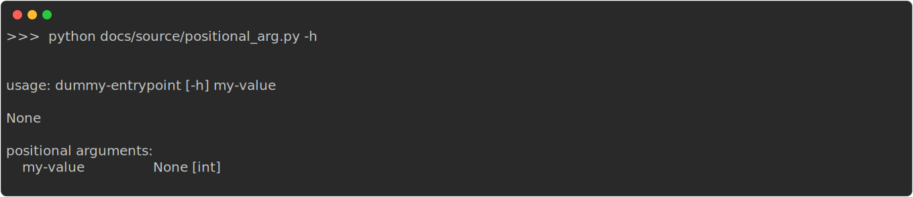
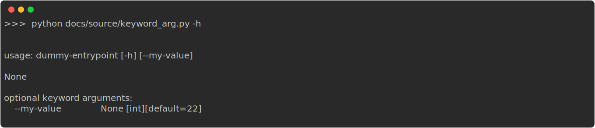
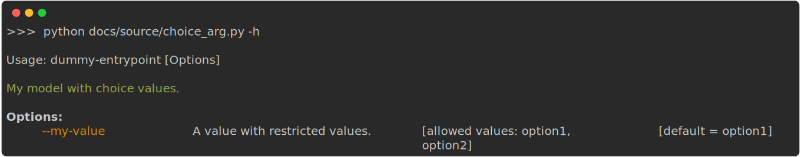
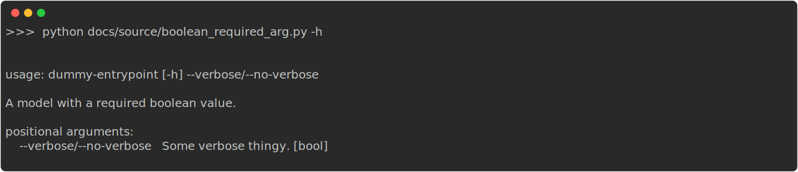
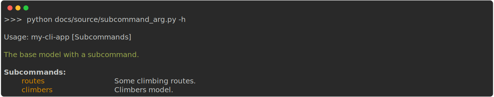
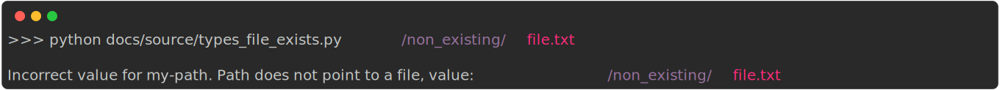
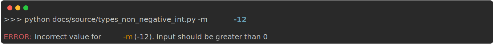

# Clipstick


A cli-tool based on Pydantic models.

There are many other tools out there that do kind of the same, 
but they all don't do quite exactly what I want.

The goal of clipstip is to use pydantic to model your cli by leveraging:

- The automatic casting of input variables.
- The powerful validation capabilities.
- Docstrings as cli documentation.
- No other mental model required than Typing and Pydantic.

Clipstick is inspired by [tyro](https://brentyi.github.io/tyro/), which is excellent and more versatile than this tool. But in my opionion its primary focus is not building a cli tool along the lines of Argparse or Click but more on composing complex objects from the command line. Making tyro behave like a "traditional" cli requires additional `Annotation` flags, which I don't want.

Some other similar tools don't support pydantic v2, so I decided to create my own. Next to that I wanted to
try and build my own parser instead of using `Argparse` because... why not.

## Installation

`pip install clipstick`


## Example

<!-- [[[cog
import cog
contents = open("examples/simple.py").read() 

cog.outl("```python")
cog.outl("")
cog.out(contents)
cog.outl("```")
]]]> -->
```python

# examples/simple.py

from pydantic import BaseModel
from clipstick import parse


class SimpleModel(BaseModel):
    """A simple model demonstrating clipstick.

    This is used in help as describing the main command.
    """

    name: str
    """Your name. This is used in help describing name."""

    repeat_count: int = 10
    """How many times to repeat your name. Used in help describing repeat_count."""

    def main(self):
        for _ in range(self.repeat_count):
            print(f"hello: {self.name}")


if __name__ == "__main__":
    model = parse(SimpleModel)
    model.main()
```
<!-- [[[end]]] -->


`python examples/simple.py -h` gives you:
<!-- [[[cog
import cog
from docs.source import cogger
from docs.source import simple as module

cog.outl(f"})")


]]]> -->

<!-- [[[end]]] -->

`python examples/simple.py alex --repeat-count 3` gives you:
<!-- [[[cog
import cog
import subprocess

result = subprocess.run(['python','examples/simple.py','alex','--repeat-count','3'],capture_output=True)
cog.outl("```")
cog.out(result.stdout.decode('utf-8'))
cog.outl("```")
]]]> -->
```
hello: alex
hello: alex
hello: alex
```
<!-- [[[end]]] -->

> [!NOTE]
> The inclusion of the `def main(self)` method is not a requirement. `clipstick` generates a pydantic model based on provided cli arguments and gives it back to you for your further usage. Using `def main()` is one of the options to further process it.


## Positional arguments

All properties in your pydantic model without a default value
are converted to cli positional arguments.


<!-- [[[cog
import cog

from docs.source import positional_arg as module
from docs.source import cogger

cog.outl(cogger.print_source(module))
cog.outl(cogger.print_output(module.MyModel,['10']))
cog.outl(f"})")


]]]> -->
```python
# docs/source/positional_arg.py

from pydantic import BaseModel
from clipstick import parse


class MyModel(BaseModel):
    """My model with a required value."""

    my_value: int
    """My required value."""


if __name__ == "__main__":
    """your cli entrypoint"""
    model = parse(MyModel)

```
```python
# >>> python docs/source/positional_arg.py 10

MyModel(my_value=10)
```

<!-- [[[end]]] -->


## Keyword arguments

All fields with a default value are converted to cli optional arguments.

<!-- [[[cog
import cog

from docs.source import keyword_arg as module
from docs.source import cogger

cog.outl(cogger.print_source(module))
cog.outl(cogger.print_output(module.MyModel,['--my-value','10']))
cog.outl(f"})")
]]]> -->
```python
# docs/source/keyword_arg.py

from typing import Annotated
from pydantic import BaseModel
from clipstick import parse, short


class MyModel(BaseModel):
    """A model with a keyworded optional value"""

    my_value: int = 22
    """My value with a default."""
    another_value: Annotated[str, short("a")] = "value"
    """Value with a shorthand"""


if __name__ == "__main__":
    model = parse(MyModel)

```
```python
# >>> python docs/source/keyword_arg.py --my-value 10

MyModel(my_value=10, another_value='value')
```

<!-- [[[end]]] -->

You can add a shorthand to a field by annotating it:

<!-- [[[cog
import cog

from docs.source import keyword_arg_with_short as module
from docs.source import cogger

cog.outl(cogger.print_source(module))
]]]> -->
```python
# docs/source/keyword_arg_with_short.py

from typing import Annotated
from pydantic import BaseModel
from clipstick import short


class MyModel(BaseModel):
    """A model with a keyworded optional value"""

    my_value: Annotated[int, short("m")] = 22  # <-- this adds a shorthand of `-m`.
    """My value with a default."""

```
<!-- [[[end]]] -->
## Choices

Choices are supported by using the `Literal` type annotation.

<!-- [[[cog
import cog

from docs.source import choice_arg as module
from docs.source import cogger

cog.outl(cogger.print_source(module))
cog.outl(cogger.print_output(module.MyModel,['--my-value','option2']))

cog.outl(f"})")


]]]> -->
```python
# docs/source/choice_arg.py

from typing import Literal
from pydantic import BaseModel
from clipstick import parse


class MyModel(BaseModel):
    """My model with choice values."""

    my_value: Literal["option1", "option2"] = "option1"
    """A value with restricted values."""


if __name__ == "__main__":
    model = parse(MyModel)

```
```python
# >>> python docs/source/choice_arg.py --my-value option2

MyModel(my_value='option2')
```

<!-- [[[end]]] -->

## Booleans/Flags

<!-- [[[cog
import cog

from docs.source import boolean_required_arg as module
from docs.source import cogger

cog.outl(cogger.print_source(module))
cog.outl(cogger.print_output(module.MyModel,['--verbose']))
cog.outl(cogger.print_output(module.MyModel,['--no-verbose']))
cog.outl(f"})")


]]]> -->
```python
# docs/source/boolean_required_arg.py

from pydantic import BaseModel
from clipstick import parse


class MyModel(BaseModel):
    """A model with a required boolean value."""

    verbose: bool
    """Some verbose thingy."""


if __name__ == "__main__":
    model = parse(MyModel)

```
```python
# >>> python docs/source/boolean_required_arg.py --verbose

MyModel(verbose=True)
```
```python
# >>> python docs/source/boolean_required_arg.py --no-verbose

MyModel(verbose=False)
```

<!-- [[[end]]] -->

Short annotations `Annotated[int, short('m')]` are also allowed.

## Subcommands

Subcommands are possible by adding a property with a union of `BaseModel`, each defined as new path in the sub-command tree.

<!-- [[[cog
import cog

from docs.source import subcommand_arg as module
from docs.source import cogger

cog.outl(cogger.print_source(module))
cog.outl(cogger.print_output(module.MyModel,['climbers','Ondra']))
cog.outl(f"})")


]]]> -->
```python
# docs/source/subcommand_arg.py

from pydantic import BaseModel
from clipstick import parse


class Routes(BaseModel):
    """Some climbing routes."""

    route_name: str
    """Name of a route."""


class Climbers(BaseModel):
    """Climbers model."""

    climber_name: str
    """Name of a climber."""


class MyModel(BaseModel):
    """The base model with a subcommand."""

    sub_command: Routes | Climbers


if __name__ == "__main__":
    model = parse(MyModel)

```
```python
# >>> python docs/source/subcommand_arg.py climbers Ondra

MyModel(sub_command=Climbers(climber_name='Ondra'))
```

<!-- [[[end]]] -->

- Only one subcommand per model is allowed. (If you need more (and want to follow the more object-composition path), have a look at [tyro](https://brentyi.github.io/tyro/))
- `sub_command` as a name is not required. Any name will do.
- Nesting of subcommands is possible.

## Validators

Using pydantic as a model definition gives you many useful types (including checks) out of the box.
For a list of pydantic types look here: https://docs.pydantic.dev/latest/api/types/

### Examples

Below code shows a pydantic type of `FilePath` 
indicating the provided argument should point to an existing file.
<!-- [[[cog
import cog

from docs.source import types_file_exists as module
from docs.source import cogger

cog.outl(cogger.print_source(module))
cog.outl(f"})")


]]]> -->
```python
# docs/source/types_file_exists.py

from pydantic import BaseModel, FilePath
from clipstick import parse


class MyModel(BaseModel):
    my_path: FilePath
    """provide an existing file location."""


if __name__ == "__main__":
    model = parse(MyModel)

```

<!-- [[[end]]] -->

Below code shows a pydantic type of `PositiveInt`
indicating the provided argument should be a positive integer.

<!-- [[[cog
import cog

from docs.source import types_non_negative_int as module
from docs.source import cogger

cog.outl(cogger.print_source(module))
cog.outl(f"})")


]]]> -->
```python
# docs/source/types_non_negative_int.py

from typing import Annotated
from pydantic import BaseModel, PositiveInt
from clipstick import parse, short


class MyModel(BaseModel):
    my_value: Annotated[PositiveInt, short("m")] = 10
    """Value must be positive"""


if __name__ == "__main__":
    model = parse(MyModel)

```

<!-- [[[end]]] -->
