# Usage

## General

Crafting your cli is identical to composing a pydantic class. Toghether with some assumptions this is enough to create a fully working cli tool.

## Positional arguments

All fields in your pydantic model *without* a default value are converted to cli positional arguments.

```{literalinclude} ../examples/positional.py
:emphasize-lines: 8
```

A positional argument is required. If you don't provide it an error will be raised. So running this without any arguments will result in the following error message:

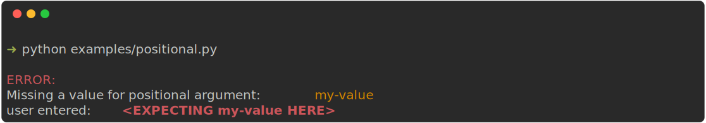

### Help output:

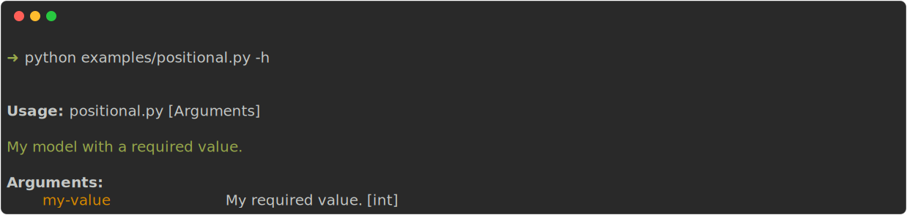


## Keyword arguments

All fields in your model *with* a default value are converted to cli optional arguments.

```{literalinclude} ../examples/keyword.py
:emphasize-lines: 8
```


### Keyword arguments with a shorthand

Add a shorthand flag to a positional argument by providing a `short` annotation.

```{literalinclude} ../examples/keyword_with_short.py
:emphasize-lines: 10
```
### Help output:

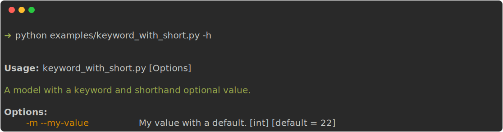

## Choices

A contraint set of values for a certain argument is defined by using the `Literal` annotation.

```{literalinclude} ../examples/choice.py
:emphasize-lines: 10
```

Failing to provide a valid value gives you the error:

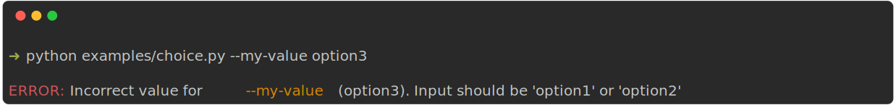

### Help output:

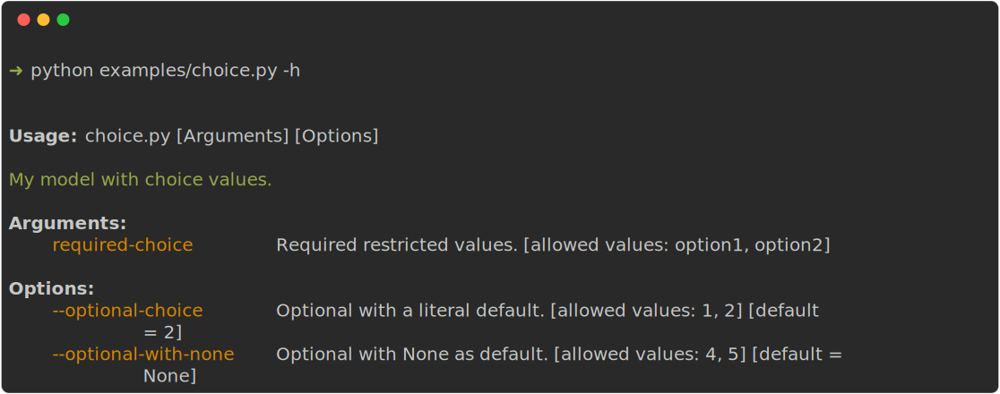


## Booleans/Flags

A flag (true/false) is defined by the `bool` annotation.

```{literalinclude} ../examples/boolean.py
:emphasize-lines: 8,11

```

### Help output:

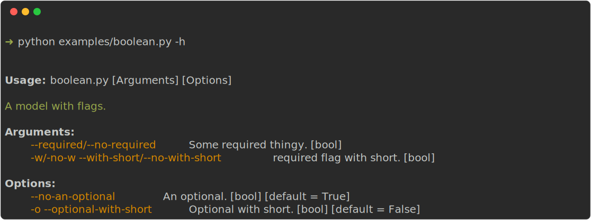

## Collections

A collection (a list of ints or string) is defined providing a keyworded argument multiple times.

```{literalinclude} ../examples/collection.py
:emphasize-lines: 8
```

### example

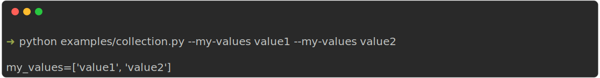

### help output
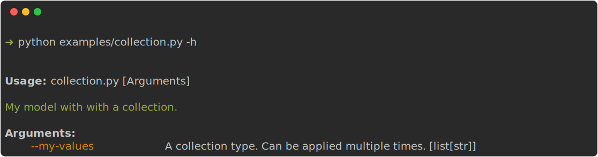

## Subcommands

Bigger cli applications will need the use of subcommands.
A probably well known example of this is the git cli which has `git clone ...`, `git merge ...` etc.
A subcommand is implemented by using pydantic models annotated with a `Union`:

```{literalinclude} ../examples/subcommand.py
:emphasize-lines: 30
```

### Help output:

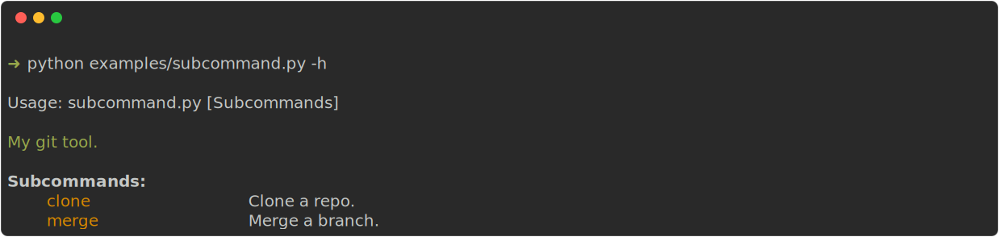

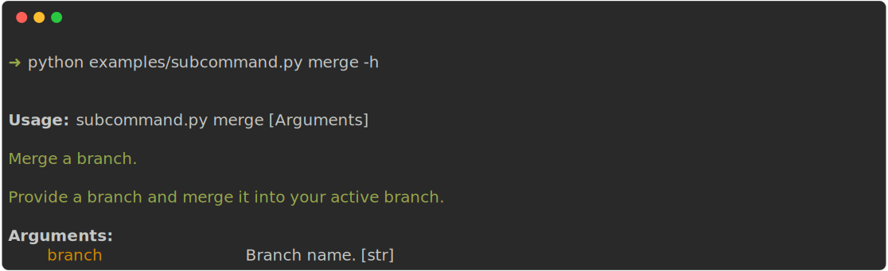

When using subcommands, be aware of the following points:

- Only one subcommand per model is allowed. (If you need more (and want to follow the more object-composition path), have a look at [tyro](https://brentyi.github.io/tyro/))
- `sub_command` as a name is not required. Any name will do.
- Nesting of subcommands is possible.

## Validators

Pydantic provides many field validators that can be used in clipstick too.

For example a cli which requires you to provide your age which can (obviously not be negative):

```{literalinclude} ../examples/types_non_negative_int.py
:emphasize-lines: 8
```

When you do provide a negative value, Pydantic raises an error which is picked up by clipstick and presented to the user.

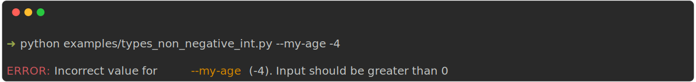

Another example would be a cli which needs a reference to an *existing* file location.

```{literalinclude} ../examples/types_file_exists.py
:emphasize-lines: 8
```

Failing to provide a valid file location gives you:

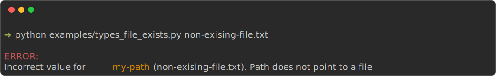

There are many more out-of-the-box validators available. Have a look [here](https://docs.pydantic.dev/latest/api/types/)
It is also pretty easy to write your own validators.
